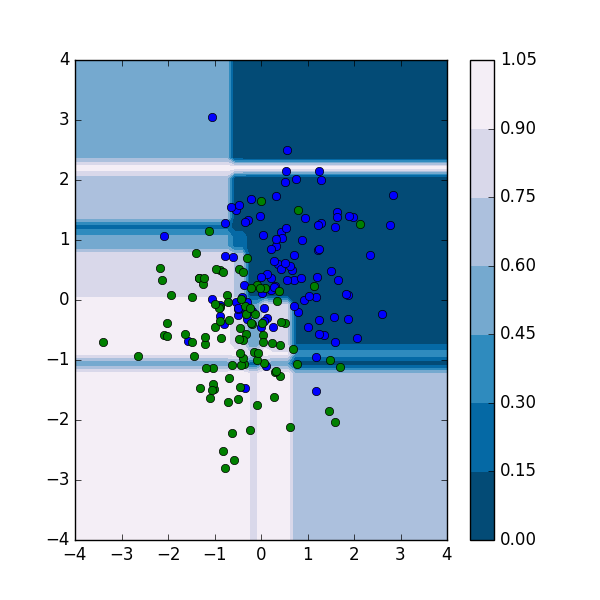

# Gradient Boosted Decision Tree

木構造のブースティングモデルによる予測器、Gradient Boosted Decision Tree の実装。

## 必要なライブラリ

* matplotlib
* numpy
* seaborn(sample.pyのグラフ表示)

## 予定

parameterとして目的関数及び活性化関数を書き換えられるような柔軟性を持たせたい

## 回帰の結果の例

### 二値分類問題

* training data: 各クラスを、[1,1] [-1.,-1]を中心としたガウス分布からのサンプリング
  * 図中で青と緑で表示
* predict: どちらのクラスかを(0,1)の確率で返す
  * Loss function: Cross Entropy
  * Activate Fn.: sigmoid $\sigma(x)$ ( $\sigma(x):=\frac{1}{1+\exp[-x]}$ )

### 結果



### sample code

```python
np.random.seed = 71
x = (
np.random.normal(loc=.5,scale=1.,size=200).reshape(100,2),
np.random.normal(loc=-.5,scale=1.,size=200).reshape(100,2),
)
t = np.zeros_like(x[0]),np.ones_like(x[1])
x = np.append(x[0],x[1],axis=0)
t = np.append(t[0],t[1],axis=0)[:,0]

crf = GradientBoostedDT(regobj=Entropy())
crf.fit(x=x,t=t)

plt.title('seqence of training loss')
plt.plot(crf.loss_log,'o-',label='training loss')
plt.legend()
plt.show()

plt.figure(figsize=(6,6))

xx = np.linspace(start=-4,stop=4,num=50)
yy = np.linspace(start=-4,stop=4,num=50)
X,Y = np.meshgrid(xx,yy)
Z = [crf.predict(np.array([a,b]).reshape(1,2))[0] for a in xx for b in yy]
Z = np.array(Z).reshape(len(xx),len(yy))
plt.contourf(X,Y,Z,6,cmap=cm.PuBu_r)
cbar = plt.colorbar()

plt.plot(x[:100,0],x[:100,1],"o")
plt.plot(x[100:,0],x[100:,1],"o")

plt.savefig('contour_predict_and_trainingdata.png',dpi=100)
```


### 連続変数に対する回帰問題

`sample.py`の`sample1`

* 入力：一次元変数
* 正しい関数：sin(x)+ノイズ（正規分布）

#### 結果


