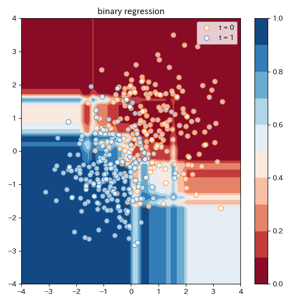
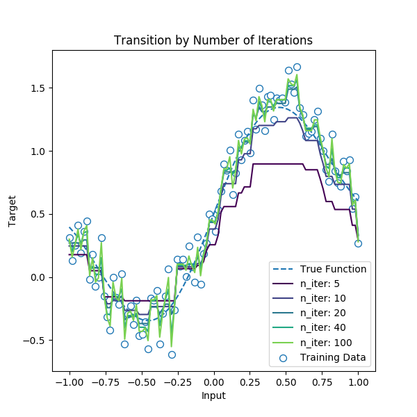

# Gradient Boosted Decision Tree

木構造のブースティングモデルによる予測器、Gradient Boosted Decision Tree の実装。

## 必要なライブラリ

* matplotlib
* numpy
* seaborn(sample.pyのグラフ表示)

## 回帰の結果の例

### 二値分類問題

* training data: 各クラスを、[1,1] [-1.,-1]を中心としたガウス分布からのサンプリング
  * 図中で青と緑で表示
* predict: どちらのクラスかを(0,1)の確率で返す
  * Loss function: Cross Entropy
  * Activate Fn.: sigmoid $\sigma(x)$ ( $\sigma(x):=\frac{1}{1+\exp[-x]}$ )

#### 結果

### 連続変数に対する回帰問題

`sample.py`の`regression_sample`

* 入力：一次元変数
* 正しい関数：sin(x)+ノイズ（正規分布）

#### 結果

